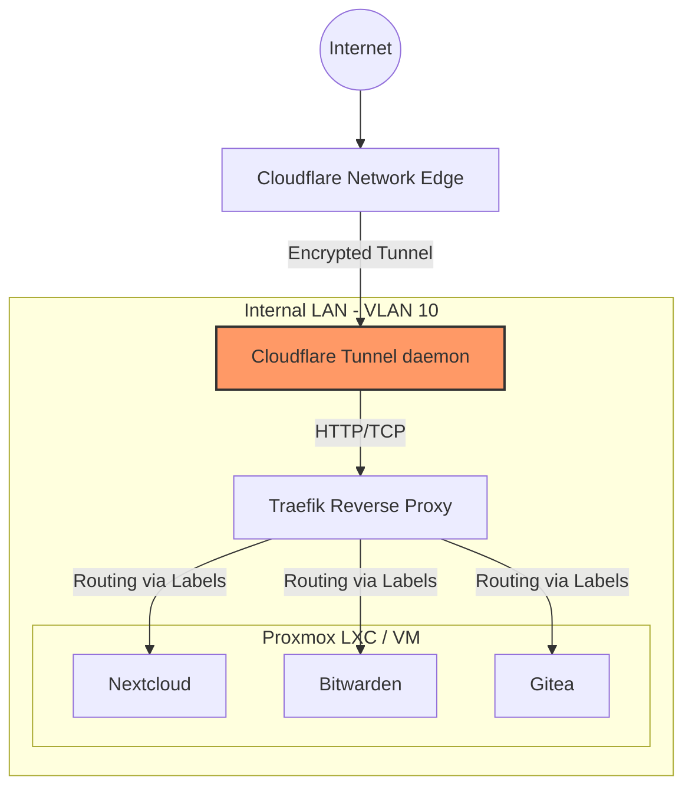

+++
title = 'Homelab Infrastructure'
date = '2026-06-01'
draft = false
tags = ['DevSecOps', 'Portfolio']
+++
# Homelab Infrastructure Architecture

## Project Overview
This repository documents my high-availability homelab infrastructure, designed to replicate enterprise production environments. It leverages Proxmox VE for hypervisor management, Docker and LXC for containerization, and Cloudflare Tunnels for secure, inbound-port-free remote access.

## Architecture Diagram

## Deployment & Configuration Steps
1. **Hypervisor Setup**: Install and harden Proxmox VE. Configure bridge networks matching physical switch VLANs.
2. **Reverse Proxy Configuration**: Deploy Traefik as the ingress controller, utilizing Docker socket proxy for enhanced security.
3. **Zero Trust Access**: Configure `cloudflared` to establish outbound tunnels to Cloudflare, mapping internal Traefik endpoints to public DNS records without opening firewall ports.
4. **Service Deployment**: Deploy services using standardized `docker-compose.yml` templates with Traefik routing labels.

## Security Controls Implemented
- **No Inbound Open Ports**: Cloudflare Tunnels negate the need for port forwarding (e.g., 80/443) on the edge router, preventing unauthenticated scanning.
- **Docker Socket Security**: The Traefik container does not mount the raw `/var/run/docker.sock`. Instead, it uses a read-only Docker socket proxy to prevent container escape vulnerabilities.
- **Network Segmentation**: Internal Docker networks are strictly segregated. Only the Traefik container resides on the edge network; application containers sit on isolated backend networks.
- **Automated TLS**: Traefik automatically provisions and renews Let's Encrypt certificates for all services.

## Verification & Testing
- **External Scanning**: Verified via Shodan and Nmap that the home public IP exposes zero open ports.
- **Access Control**: Validated Cloudflare Access policies, ensuring only authorized identities (via GitHub/Google SSO) can access internal administrative panels.

