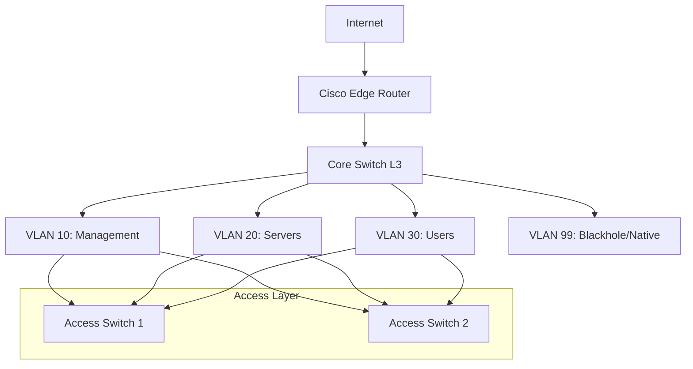

+++
title = 'Network Hardening'
date = '2026-06-01'
draft = false
tags = ['DevSecOps', 'Portfolio']
+++
# Network Architecture & Hardening

## Project Overview
This repository contains configuration standards, architectural diagrams, and implementation guides for hardening Cisco-based enterprise networks. It focuses on Layer 2 and Layer 3 security features, demonstrating a defense-in-depth approach to network design.

## Architecture Diagram

## Deployment & Configuration Steps
1. **VLAN Segmentation**: Segregate user, server, and management traffic into isolated broadcast domains.
2. **Trunk Hardening**: Disable DTP (Dynamic Trunking Protocol), statically set trunk modes, and utilize an unused native VLAN (e.g., VLAN 99) to mitigate VLAN hopping attacks.
3. **Port Security**: Implement MAC address limiting and sticky MACs on edge access ports.
4. **Access Control Lists (ACLs)**: Deploy standard and extended ACLs on the L3 Core to restrict inter-VLAN routing based on the principle of least privilege.

## Security Controls Implemented
- **BPDU Guard & PortFast**: Configured on all access ports to prevent rogue switches from hijacking the Spanning Tree Protocol (STP) root bridge.
- **DHCP Snooping**: Mitigates rogue DHCP server attacks by trusting only legitimate uplink ports.
- **Dynamic ARP Inspection (DAI)**: Prevents ARP spoofing and Man-in-the-Middle (MitM) attacks by validating ARP packets against the DHCP snooping binding database.
- **Control Plane Policing (CoPP)**: Protects the router's CPU from DoS attacks by rate-limiting management and control plane traffic.

## Verification & Testing
- **Penetration Testing**: Attempted VLAN hopping (Yersinia) and ARP spoofing (Ettercap) from a Kali Linux endpoint; verified that switch security features successfully dropped the malicious frames.
- **Routing Validation**: Verified that user VLANs cannot ping the management VLAN but can access specific resources in the server VLAN via ACL hit counters.

