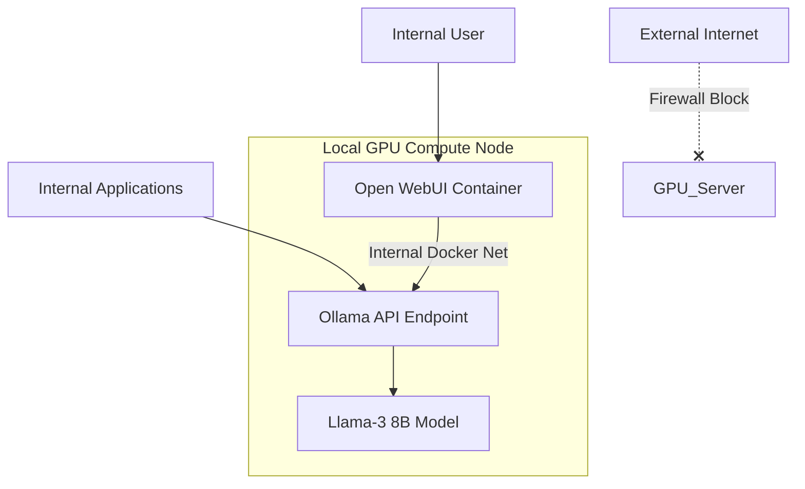

+++
title = 'Private Ai Infrastructure'
date = '2026-06-01'
draft = false
tags = ['DevSecOps', 'Portfolio']
+++
# Private AI Infrastructure & Orchestration

## Project Overview
As AI integration becomes critical for enterprise operations, data privacy and sovereignty are paramount. This project demonstrates the deployment of a fully localized, air-gapped capable Large Language Model (LLM) infrastructure utilizing Ollama and Open WebUI, ensuring proprietary data never leaves the internal network.

## Architecture Diagram

## Deployment & Configuration Steps
1. **Environment Setup**: Provision a Linux host with appropriate NVIDIA/AMD GPU drivers and the container toolkit.
2. **Orchestration**: Utilize the provided deployment scripts to spin up Ollama and pull specific models (e.g., `llama3`, `mistral`).
3. **Frontend Integration**: Deploy Open WebUI via Docker, linking it directly to the local Ollama API instance for a ChatGPT-like internal experience.
4. **API Security**: Configure network access controls to restrict API access solely to authorized internal subnets.

## Security Controls Implemented
- **Data Sovereignty**: 100% local processing guarantees that sensitive prompts, source code, and internal documents are not exposed to third-party APIs.
- **Network Isolation**: The GPU server is explicitly denied outbound internet access via hardware firewall rules after the initial model pull.
- **Container Hardening**: Deploying AI services in rootless Docker containers to minimize the blast radius of potential model execution vulnerabilities.
- **Access Control**: Implementing Reverse Proxy authentication (via Traefik/Authelia) in front of Open WebUI to enforce MFA.

## Verification & Testing
- **Packet Capture**: Monitored network interfaces during model inference to verify zero outbound API calls were made.
- **Load Testing**: Evaluated GPU VRAM allocation and API response times under simulated concurrent user requests.

