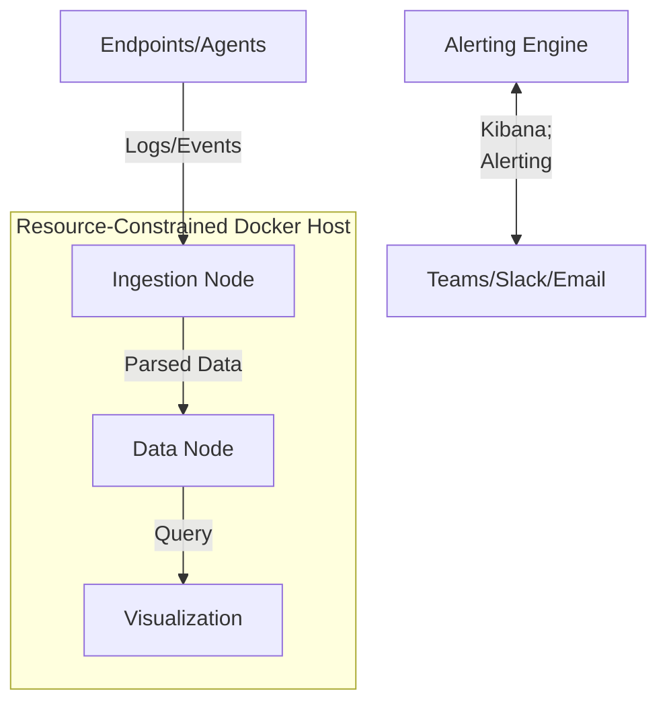

+++
title = 'Siem Soc Deployment'
date = '2026-06-01'
draft = false
tags = ['DevSecOps', 'Portfolio']
+++
# SIEM & SOC Deployment Lab

## Project Overview
This project demonstrates the design and deployment of a localized Security Operations Center (SOC) using a containerized Security Information and Event Management (SIEM) solution. The primary objective is to showcase resource optimization techniques, enabling robust security monitoring on hardware-constrained edge devices or homelab environments.

## Architecture Diagram

## Deployment & Configuration Steps
1. **Host Preparation**: Configure kernel parameters (e.g., `vm.max_map_count`) for Elasticsearch.
2. **Resource Throttling**: Apply strict memory (`mem_limit`) and CPU (`cpus`) constraints within the Docker Compose configuration to prevent the SIEM from monopolizing host resources.
3. **Container Orchestration**: Deploy the stack using `docker-compose up -d`.
4. **Agent Deployment**: Configure endpoint agents (e.g., Filebeat, Winlogbeat) to forward logs securely to the ingestion node.

## Security Controls Implemented
- **Resource Quotas**: Prevents Denial of Service (DoS) conditions on the host by limiting the maximum compute the SIEM stack can consume.
- **Network Isolation**: The Elastic stack components communicate over an isolated internal Docker network, exposing only the Kibana UI to the administrator network.
- **Data Retention Policies**: Automated Index Lifecycle Management (ILM) to rotate and delete old logs, preventing storage exhaustion.

## Verification & Testing
- **Resource Monitoring**: Verified via `docker stats` that Elasticsearch respects the 2GB memory limit and 1.5 CPU core restriction under heavy index loads.
- **Event Flow**: Successfully ingested mock authentication failure logs and visualized them on a custom Kibana dashboard.

