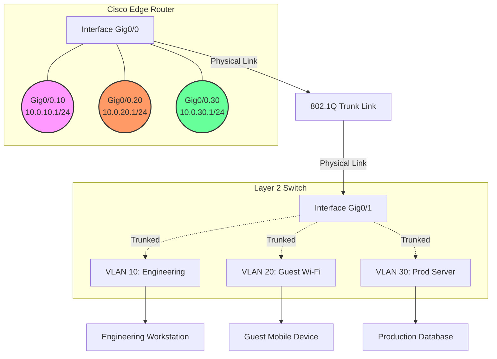

+++
title = 'Zero-Trust Network Segmentation: Router-on-a-Stick'
date = '2026-06-01'
draft = false
tags = ['DevSecOps', 'Network Hardening', 'Cisco', 'Zero Trust']
+++

# Zero-Trust Network Segmentation

## Project Overview
This lab demonstrates the implementation of a Zero-Trust architecture at the network edge using Cisco IOS devices. By leveraging a "Router-on-a-Stick" (RoaS) topology, we enforce strict inter-VLAN routing controls and isolate critical environments. The primary objective is to ensure that compromised endpoints in lower-trust zones (like Guest Wi-Fi) cannot pivot into high-trust zones (like Production Servers).

## Topology & Architecture



## Security Access Matrix

| Source Zone | Destination Zone | Protocol | Action | Rationale |
| :--- | :--- | :--- | :--- | :--- |
| **VLAN 10** (Eng) | **VLAN 30** (Prod) | TCP 22 (SSH) | `PERMIT` | Engineering requires secure admin access to servers. |
| **VLAN 10** (Eng) | **VLAN 30** (Prod) | ICMP (Echo) | `PERMIT` | Engineering requires diagnostic capability. |
| **VLAN 20** (Guest) | **VLAN 10** / **30** | ANY | `DENY` | Guests must be completely isolated from internal assets. |
| **VLAN 20** (Guest) | **Internet** | HTTP/HTTPS | `PERMIT` | Guests are only allowed outbound web traffic. |
| **ANY** | **ANY** | ANY | `DENY` | Implicit deny all (Zero-Trust baseline). |

## Cisco IOS Configuration

### 1. Layer 2 Switch: VLAN & Trunk Configuration
```cisco
! Create VLANs
vlan 10
 name ENGINEERING
vlan 20
 name GUEST_WIFI
vlan 30
 name PROD_SERVER
exit

! Configure Trunk Port to Router
interface GigabitEthernet0/1
 description UPLINK_TO_ROUTER
 switchport trunk encapsulation dot1q
 switchport mode trunk
 ! Hardening: Disable DTP and set unused native VLAN
 switchport nonegotiate
 switchport trunk native vlan 99
exit

! Assign Access Ports
interface FastEthernet0/10
 switchport mode access
 switchport access vlan 10
exit
```

### 2. Core Router: Router-on-a-Stick Configuration
```cisco
! Enable Physical Interface
interface GigabitEthernet0/0
 no ip address
 no shutdown
exit

! Engineering Sub-Interface (VLAN 10)
interface GigabitEthernet0/0.10
 encapsulation dot1Q 10
 ip address 10.0.10.1 255.255.255.0
 ip access-group ENG_TO_PROD in
exit

! Guest Wi-Fi Sub-Interface (VLAN 20)
interface GigabitEthernet0/0.20
 encapsulation dot1Q 20
 ip address 10.0.20.1 255.255.255.0
 ip access-group GUEST_ISOLATION in
exit

! Prod Server Sub-Interface (VLAN 30)
interface GigabitEthernet0/0.30
 encapsulation dot1Q 30
 ip address 10.0.30.1 255.255.255.0
exit
```

### 3. Core Router: Access Control Lists (Zero-Trust Enforcement)
```cisco
! Engineering ACL: Restrict access to Prod Servers
ip access-list extended ENG_TO_PROD
 permit tcp 10.0.10.0 0.0.0.255 10.0.30.0 0.0.0.255 eq 22
 permit icmp 10.0.10.0 0.0.0.255 10.0.30.0 0.0.0.255 echo
 deny ip 10.0.10.0 0.0.0.255 10.0.30.0 0.0.0.255 log
 permit ip 10.0.10.0 0.0.0.255 any

! Guest ACL: Total isolation from internal networks
ip access-list extended GUEST_ISOLATION
 deny ip 10.0.20.0 0.0.0.255 10.0.10.0 0.0.0.255 log
 deny ip 10.0.20.0 0.0.0.255 10.0.30.0 0.0.0.255 log
 permit tcp 10.0.20.0 0.0.0.255 any eq 80
 permit tcp 10.0.20.0 0.0.0.255 any eq 443
 deny ip any any
```

## Verification & Metrics
- **Routing Verification**: `show ip route` confirms Connected routes for all three sub-interfaces.
- **ACL Hit Counters**: `show access-lists` validates that `DENY` statements are actively dropping unauthorized packets originating from VLAN 20 attempting to reach VLAN 30.
- **Ping Sweep**: Executed an Nmap ping sweep from a Guest VM; verified 100% packet loss to the `10.0.30.0/24` subnet.
